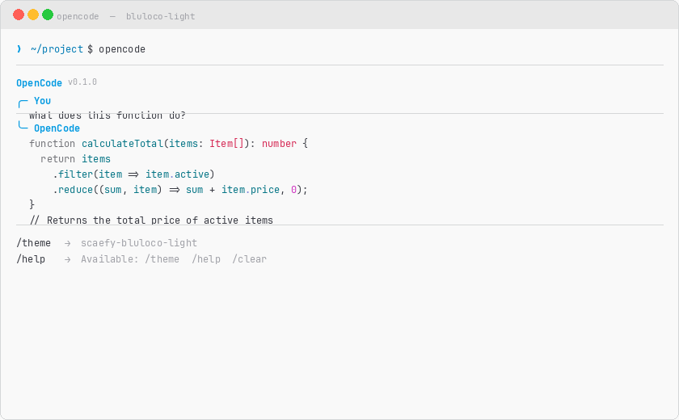
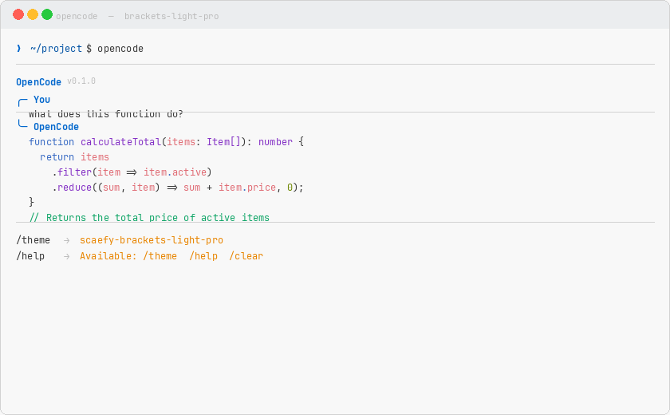
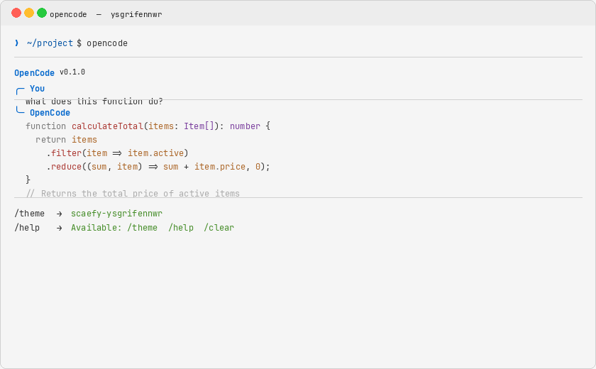
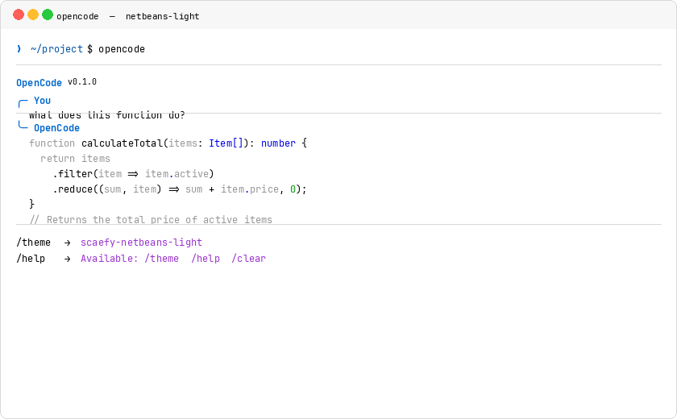
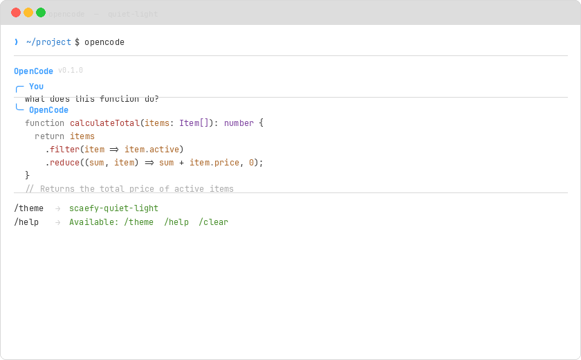
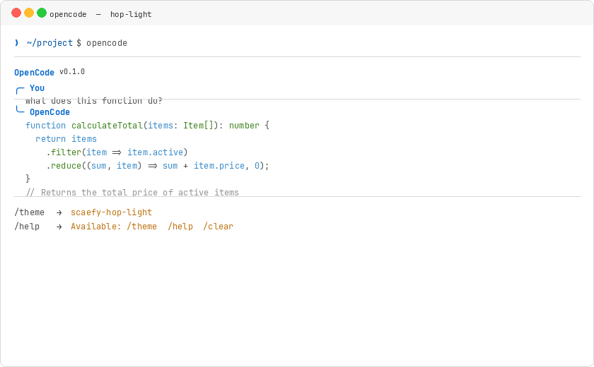
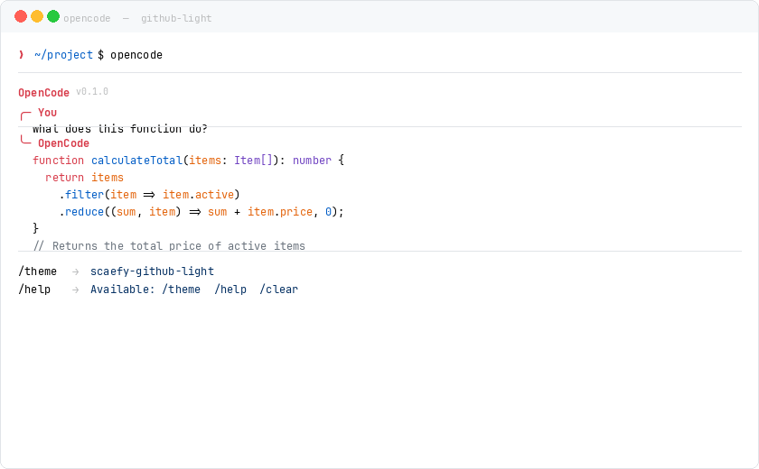
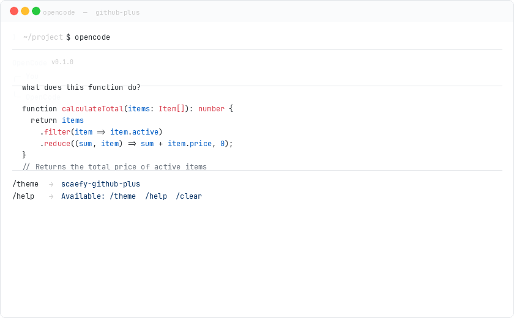

# OpenCode Light Themes

A curated collection of light color themes for [OpenCode](https://opencode.ai).

Built by **Scaefy** — modern hosting, domain, and server solutions. Learn more at [scaefy.com](https://scaefy.com).

| Platform | Repository |
|----------|------------|
| GitHub | [github.com/fatihtoprakk/opencode-light-themes](https://github.com/fatihtoprakk/opencode-light-themes) |
| GitLab | [gitlab.com/fatihtoprak/opencode-light-themes](https://gitlab.com/fatihtoprak/opencode-light-themes) |

---

## Why This Repository is Needed — Bu Depo Neden Gerekli?

**EN:** OpenCode has not removed light (light mode) themes, but recent updates to the menu structure and bug fixes have made them harder to find or they may appear temporarily unavailable. The main reasons users might have difficulty accessing light themes are:

- **Hidden Menu Structure:** Light themes are no longer listed prominently in the default `/themes` command. Instead, press **Ctrl + P** and search for `"Toggle theme mode"` or `"Switch to light mode"` to switch between dark and light variants.
- **Compatibility & Visibility Issues:** Previous updates introduced technical issues with automatic background detection (OSC 11 query), causing text in code or input fields to become invisible on certain light configurations. Some light variants were temporarily disabled while fixes were applied.
- **Terminal Transparency:** Updates enabling terminal transparency affected contrast calculations for light themes, causing some users to see only dark themes by default.

To activate a light theme, press **Ctrl + P**, type `"Switch to light mode"`, and select the command. You can also install any theme from this repository manually into `~/.config/opencode/themes/`.

---

**TR:** OpenCode, açık (light) temaları kaldırmamıştır, ancak menü yapısındaki güncellemeler ve hata düzeltmeleri nedeniyle bu temaları bulmak zorlaşmış veya geçici olarak kullanılamaz hale gelmiş olabilir. Kullanıcıların açık temalara erişememesinin başlıca nedenleri:

- **Gizli Menü Yapısı:** Açık temalar artık `/themes` komutunda doğrudan listelenmemektedir. Bunun yerine **Ctrl + P** tuşlarına basıp `"Toggle theme mode"` veya `"Switch to light mode"` yazarak koyu/açık tema arasında geçiş yapabilirsiniz.
- **Uyumluluk ve Görünürlük Sorunları:** Önceki güncellemelerde otomatik arka plan algılama (OSC 11 sorgusu) ile ilgili teknik sorunlar yaşanmış, bazı açık tema varyantlarında kod veya giriş alanlarındaki metinler görünmez olmuştur. Bu nedenle bazı varyantlar geçici olarak devre dışı bırakılmıştır.
- **Terminal Şeffaflığı:** Terminal şeffaflığı özelliği, açık temalarda kontrast hesaplamalarını etkilemiş ve bazı kullanıcılar varsayılan olarak yalnızca koyu temaları görmeye başlamıştır.

Açık temayı etkinleştirmek için **Ctrl + P** tuşlarına basın, `"Switch to light mode"` yazın ve komutu seçin. Bu depodaki temaları manuel olarak `~/.config/opencode/themes/` dizinine kopyalayarak da kullanabilirsiniz.

---

## Themes / Temalar

| Theme | Description / Açıklama | Screenshot |
|-------|------------------------|------------|
| scaefy-light | A clean, bright theme based on Atom One Light |  |
| scaefy-solarized-light | Solarized — warm, earthy, low contrast |  |
| scaefy-vivid-light | Vivid — bright, saturated, modern |  |
| scaefy-coffee-cream | Coffee cream — warm beige with rich accents |  |
| scaefy-gold-d-raynh-light | Gold D Raynh — vibrant blue & gold tones |  |
| scaefy-melle-julie-light | Melle Julie — soft teal with purple accents |  |
| scaefy-classic-light | Classic — clean neutral light theme |  |
| scaefy-hc-flurry | HC Flurry — high contrast light theme |  |
| scaefy-milkshake-raspberry | Milkshake Raspberry — pink-toned |  |
| scaefy-milkshake-blueberry | Milkshake Blueberry — blue-purple |  |
| scaefy-milkshake-mango | Milkshake Mango — warm orange |  |
| scaefy-milkshake-mint | Milkshake Mint — cool green |  |
| scaefy-milkshake-vanilla | Milkshake Vanilla — warm yellow |  |
| scaefy-bluloco-light | A fancy and sophisticated light color scheme from Bluloco Light |  |
| scaefy-brackets-light-pro | A light theme inspired by the Brackets editor default look |  |
| scaefy-ysgrifennwr | A light color scheme based on the Ysgrifennwr theme for writers |  |
| scaefy-netbeans-light | A light theme replicating the NetBeans IDE default look |  |
| scaefy-quiet-light | A finely tuned light theme with soft, easy-on-the-eyes colors |  |
| scaefy-hop-light | A fresh, hop-inspired light theme with italic variants |  |
| scaefy-github-light | A light theme based on GitHub's own color scheme |  |
| scaefy-github-plus | A modern light theme inspired by GitHub color palette |  |

---

## Installation / Kurulum

### Automatic / Otomatik (recommended / önerilen)

```bash
chmod +x install.sh
./install.sh
```

### Manual / Elle

**EN:** Copy the theme JSON file to your OpenCode themes directory:

**TR:** Tema JSON dosyasını OpenCode tema dizininize kopyalayın:

```bash
cp themes/scaefy-light.json ~/.config/opencode/themes/
```

Then set it in `~/.config/opencode/tui.json`:
Ardından `~/.config/opencode/tui.json` dosyasında ayarlayın:

```json
{
  "theme": "scaefy-light"
}
```

---

## Usage / Kullanım

**EN:** Start OpenCode and use the `/theme` command to select your theme, or set it in `tui.json`.

**TR:** OpenCode'u başlatın ve tema seçmek için `/theme` komutunu kullanın veya `tui.json` dosyasında ayarlayın.

---

## Contributing / Katkı

**EN:**
1. Fork the repository
2. Add your theme JSON file under `themes/`
3. Add a screenshot under `screenshots/`
4. Update README.md table
5. Submit a Pull Request

**TR:**
1. Depoyu fork edin
2. Tema JSON dosyanızı `themes/` altına ekleyin
3. Ekran görüntüsünü `screenshots/` altına ekleyin
4. README.md tablosunu güncelleyin
5. Pull Request gönderin

---

## License / Lisans

MIT

---

[](https://github.com/awesome-opencode/awesome-opencode)

*Part of the [Scaefy](https://scaefy.com) open source ecosystem.*
