# OpenCode Light Themes

A curated collection of light color themes for [OpenCode](https://opencode.ai).

Built by **Scaefy** — modern hosting, domain, and server solutions. Learn more at [scaefy.com](https://scaefy.com).

| Platform | Repository |
|----------|------------|
| GitHub | [github.com/fatihtoprakk/opencode-light-themes](https://github.com/fatihtoprakk/opencode-light-themes) |
| GitLab | [gitlab.com/fatihtoprak/opencode-light-themes](https://gitlab.com/fatihtoprak/opencode-light-themes) |

## Themes

| Theme | Description | Screenshot |
|-------|-------------|------------|
| scaefy-light | A clean, bright light theme based on Atom One Light | 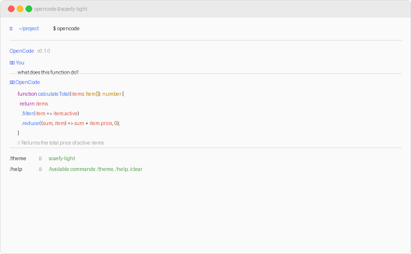 |
| scaefy-solarized-light | Solarized light — warm, earthy, low contrast | 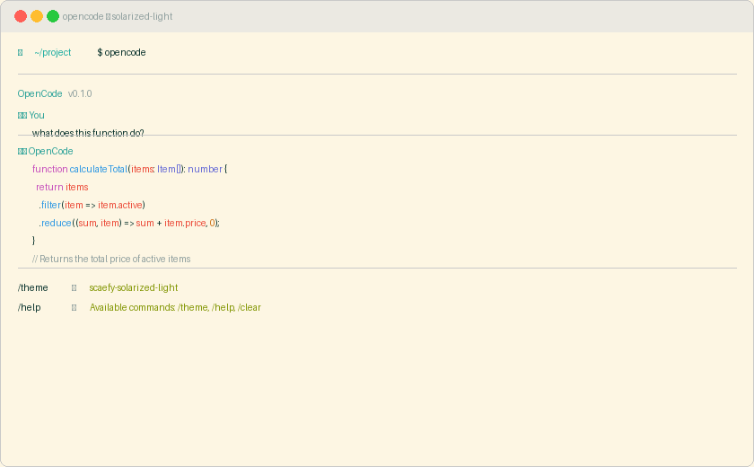 |
| scaefy-vivid-light | Vivid light — bright, saturated, modern | 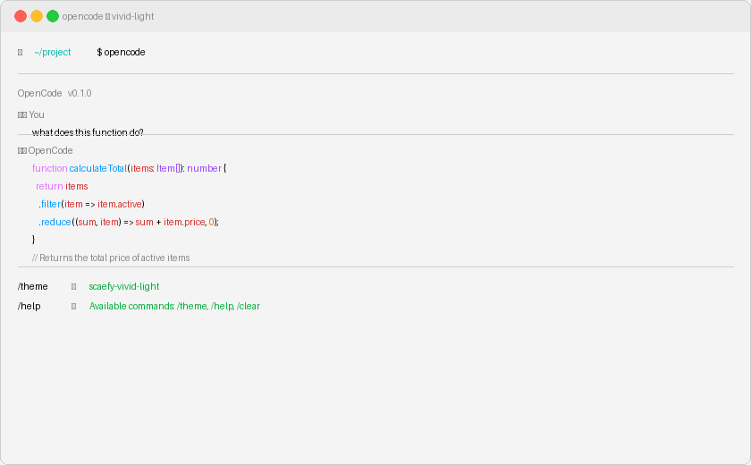 |
| scaefy-coffee-cream | Coffee cream — warm beige with rich accents | 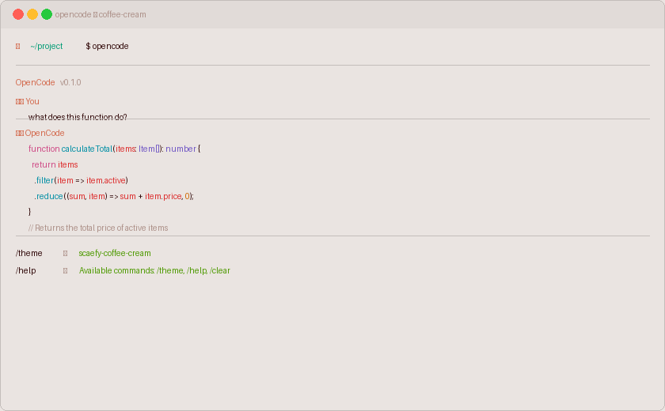 |
| scaefy-gold-d-raynh-light | Gold D Raynh — vibrant blue & gold tones | 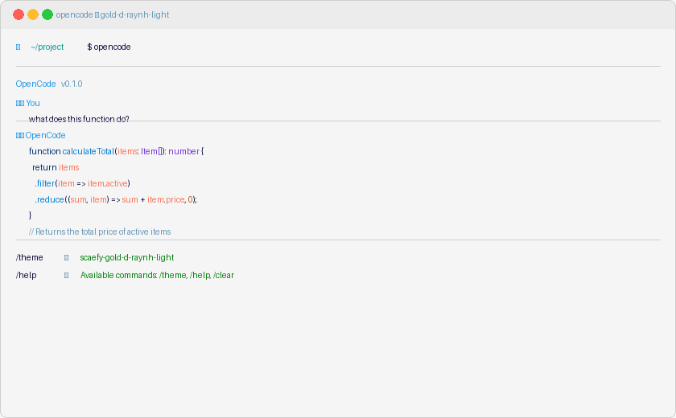 |
| scaefy-melle-julie-light | Melle Julie Light — soft teal with purple accents | 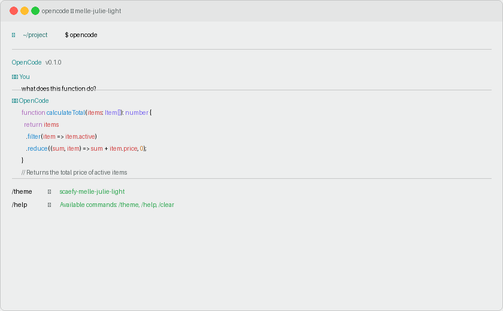 |
| scaefy-classic-light | Classic light — clean neutral light theme | 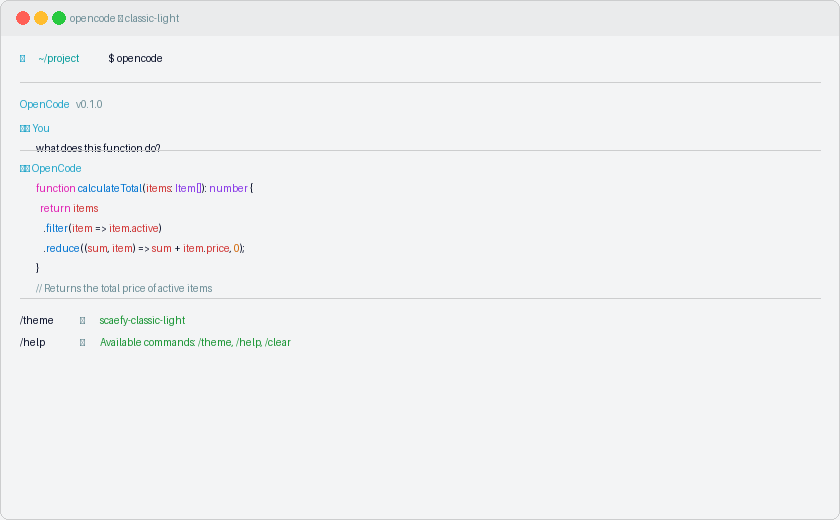 |
| scaefy-hc-flurry | HC Flurry — high contrast light theme | 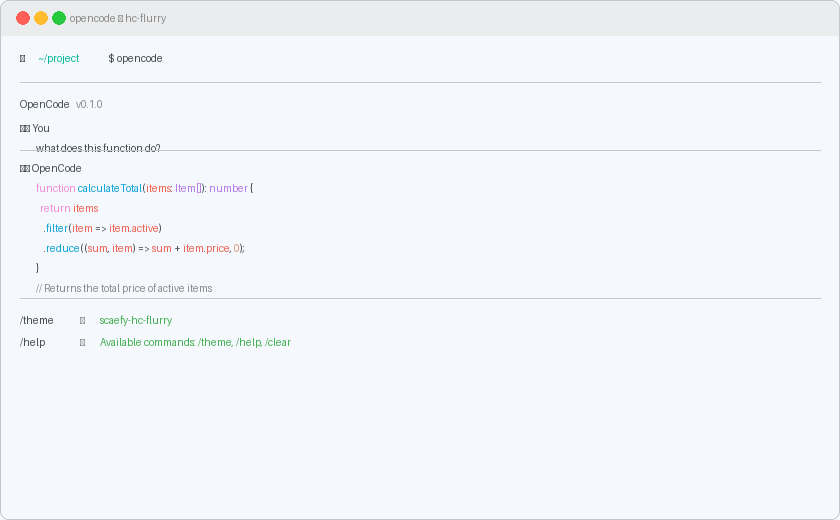 |
| scaefy-milkshake-raspberry | Milkshake Raspberry — pink-toned light theme | 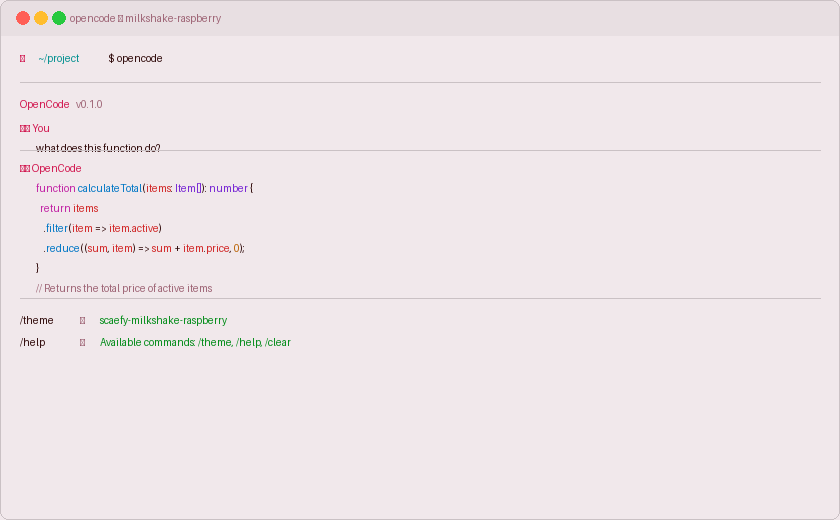 |
| scaefy-milkshake-blueberry | Milkshake Blueberry — blue-purple light theme | 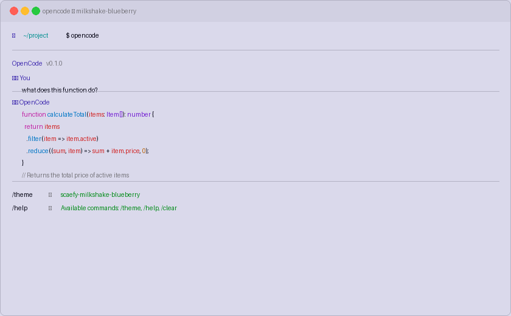 |
| scaefy-milkshake-mango | Milkshake Mango — warm orange light theme | 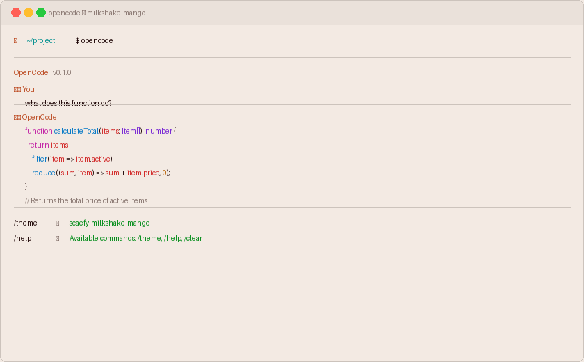 |
| scaefy-milkshake-mint | Milkshake Mint — cool green light theme | 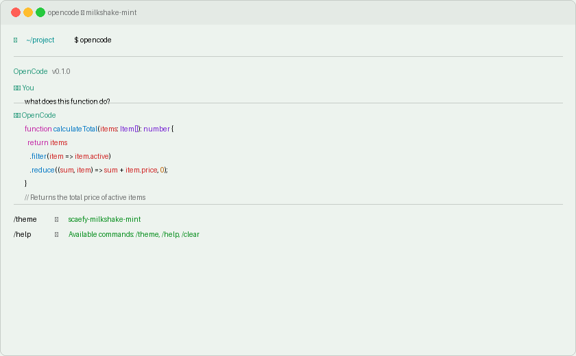 |
| scaefy-milkshake-vanilla | Milkshake Vanilla — warm yellow light theme | 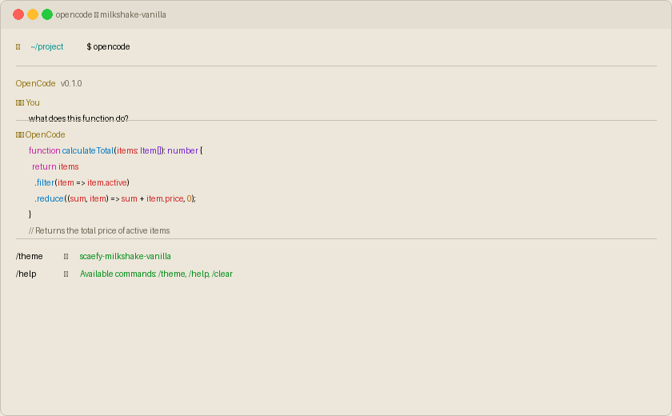 |

## Installation

### Automatic (recommended)

```bash
chmod +x install.sh
./install.sh
```

### Manual

Copy the desired theme JSON file to your OpenCode themes directory:

```bash
cp themes/scaefy-light.json ~/.config/opencode/themes/
```

Then set it in `~/.config/opencode/tui.json`:

```json
{
  "theme": "scaefy-light"
}
```

## Usage

Start OpenCode and use the `/theme` command to select your theme, or set it in `tui.json`.

## Contributing

1. Fork the repository
2. Add your theme JSON file under `themes/`
3. Add a screenshot under `screenshots/`
4. Update README.md table
5. Submit a Pull Request

## License

MIT

---

*Part of the [Scaefy](https://scaefy.com) open source ecosystem.*
